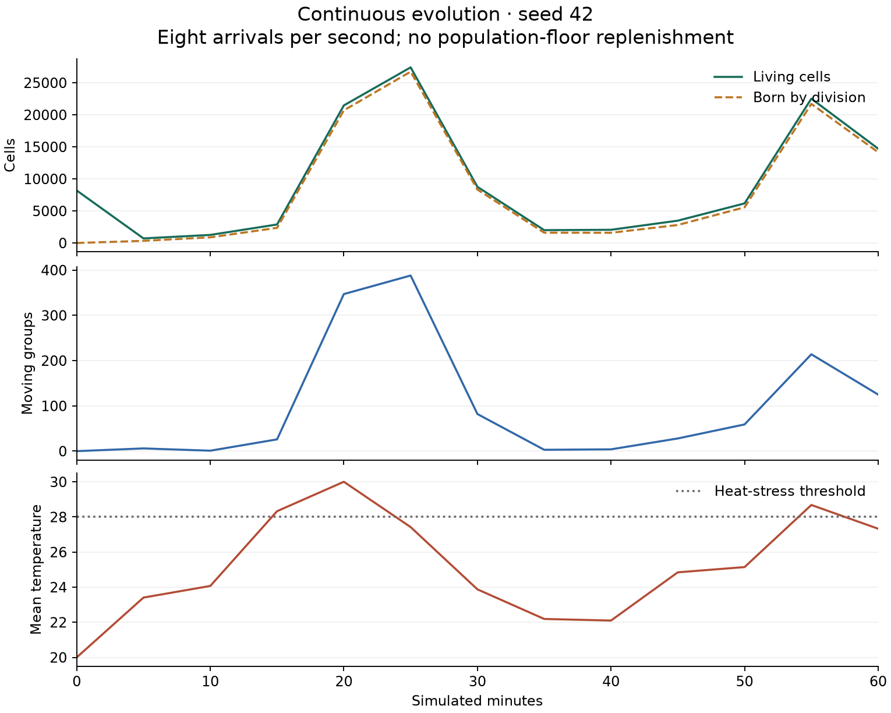
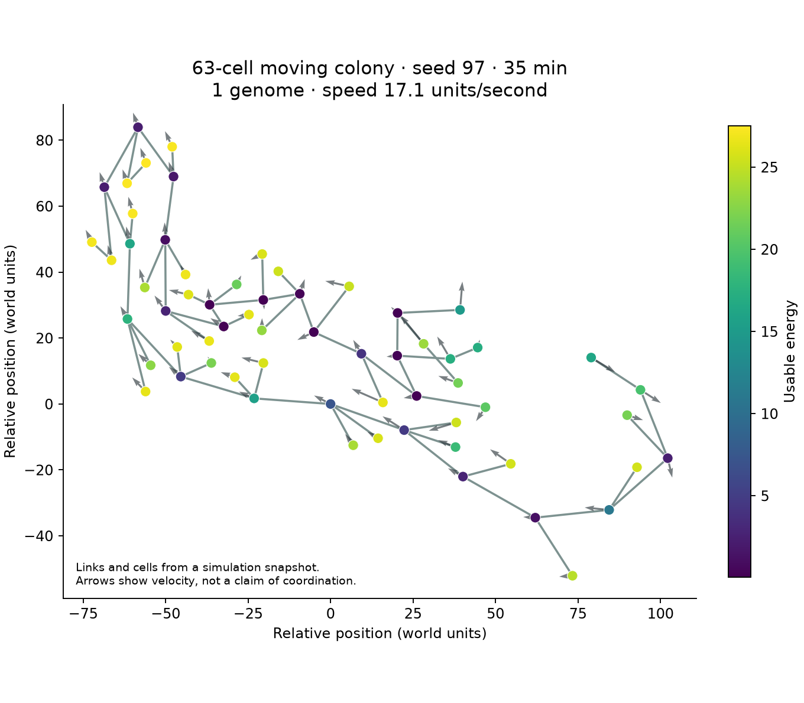

# Continuous evolution and a cooperative colony

Three one-hour simulations retained continuous random and archived arrivals,
with population-floor replenishment disabled. This preserves the requested
source of mutation while distinguishing imports from cells born by division.
All runs used the published tree sampler, ordinary sunlight/thermal physics,
32,768 entity slots, and 8,192 random founders. Division never mutated genomes.

| Seed | Living at one hour | Born by division | Moving groups | Cells in moving groups |
| ---- | -----------------: | ---------------: | ------------: | ---------------------: |
| 42   |             14,720 |           14,167 |           125 |                    961 |
| 97   |             11,015 |           10,510 |           152 |                  1,397 |
| 321  |             32,765 |           32,247 |            13 |                     82 |

Each seed is one trajectory. The largest population has the fewest moving
groups, so population size is not a substitute for structured complexity.
Neither open-ended evolution nor a quantitative epiplexity increase is proved.
The summaries and raw paths are in [continuous-evolution.json](results/continuous-evolution.json).



## A naturally generated energy-sharing genotype

At minute 35 of seed 97, a captured 63-cell colony consisted of genome 15333.
It was created at tick 53,580 through crossover of genomes 13249 and 6046.
Its program gives energy to link slot `c2`, photosynthesizes, eats, moves, and
buds. The gift fraction is `(bonds)`, which saturates at one whenever that third
link exists. Thus a donor offers nearly all usable energy, subject to the normal
reserve and recipient-capacity rules. This observation was selected after the
run; it was not an authored organism injected into an evolutionary population.



The picture shows a pronounced energy imbalance, but an imbalance alone is not
evidence of cooperation. A controlled assay regrew this genotype from one fresh
cell, comparing it with an otherwise identical program whose gift fraction was
zero. The intervention changes exactly one compiled sensor instruction to a
constant-zero instruction. Instruction count and all other compiled instructions
remain identical.

Both conditions used constant full sunlight, normal physical and energy costs,
70 initial energy, zero stored reserves, no immigration, no mutation, and a
4,096-cell capacity. After 300 simulated seconds, the instrumented repeat gave:

| Seed | Original: living | Gift disabled: living | Original: births | Gift disabled: births |
| ---- | ---------------: | --------------------: | ---------------: | --------------------: |
| 42   |              501 |                     8 |              526 |                     7 |
| 97   |            4,096 |                     8 |            4,481 |                     7 |
| 321  |            4,096 |                    16 |            4,507 |                    15 |
| 617  |            2,278 |                     8 |            2,472 |                     7 |
| 731  |            4,096 |                     8 |            4,757 |                     7 |

Every original population contained cells with the third link available for
giving. An earlier full-sunlight batch also favored the original in all five
seeds: 1,902–4,096 living versus 8–76. Results vary because GPU physical contention
does not make same-seed worlds deterministic paired counterfactuals. Several
original populations reached capacity, limiting the measured difference.

This supports a reproductive benefit from energy transfer **for this genotype
under these bright-light conditions**. It does not prove a benefit under all
cloud conditions, predator pressure, or mixed-genotype competition, nor does it
establish distinct inherited cell roles or neural coordination. A
[follow-up under clouds and introduced non-givers](colony-invasion.md) tests
some of those limits. A retained pilot
at sunlight 0.6 stalled at two cells in both conditions; that pilot did not grow
enough links to exercise the selected transfer behavior.

Raw assay results are [the instrumented repeat](results/colony-gift-probe.json),
[the earlier full-sunlight batch](results/colony-gift-fullsun-repeat1.json), and
[the lower-light pilot](results/colony-gift-pilot.json). Reproduce the instrumented
assay with:

```sh
node research/colony-gift-probe.mjs research/runs/continuous-memory-control-97/observation-2100.json research/results/replay-gifts.json 1
```

## Memory and observation limits

The three runs contain 33, 40, and 5,557 cells with user-memory reads. Many common
readers in seed 321 calculate a value for `(give (none) ...)`; the nonexistent
recipient makes the gift ineffective. Presence of memory syntax therefore does
not establish behavioral or fitness dependence. The separate earlier memory
probe established stored-sunlight control of shielding in one isolated cell,
but did not establish useful recurrent computation.

Future runs now save population progress atomically at each sample and retain
the actual leader genomes and representative whole colonies, including topology,
velocity, energy, registers, user memory, and state initialization flags. Oversize
colonies are reported as omitted rather than truncated. These observations are
for inspection, not exact world-restart snapshots. Seed 42 predates this capture;
seeds 97 and 321 include it. Tests cover reciprocal links, periodic coordinates,
cell-state association, and explicit omission of oversized bodies.

## Making energy transfer visible

The live renderer now draws green arrows for completed energy gifts from the
most recent simulated tick when Activity is enabled. It reads existing GPU
buffers directly, with no per-cell download. Source and recipient incarnation
checks prevent recycled slots from displaying stale transfers. These arrows
show explicit giving, not passive diffusion of stored reserves. Biology,
mutation rates, and random founding programs are unchanged.

Real GPU pixel tests verify visible arrows, the Activity toggle, and stale-source
and stale-recipient suppression. The local browser also runs the new renderer
without reported GPU or JavaScript errors.

## Motion versus recent thrust

The moving-group count is a kinematic measure, not proof of locomotion. In the
conditional-insertion experiment, a captured moving colony had no `move` action;
external collisions and link forces can move bodies. Future research samples
therefore also count moving groups with at least one member that successfully
executed nonzero forward/backward thrust in the preceding 60 ticks. Activity
marks are checked against the cell's incarnation so recycled slots cannot
inherit old motion records. Zero-thrust instructions do not qualify.

The new fields are `recentThrustCells`, `movingBodiesWithRecentThrust`,
`movingBodyCellsWithRecentThrust`, `largestMovingBodyWithRecentThrust`, and
`movingBodiesWithoutRecentThrust`. Selected colony cells retain their last thrust,
attack, and eating ticks. These are occasional research readbacks of an existing
GPU buffer; the live simulator and its physics are unchanged.

Recent thrust still does not prove that thrust caused the observed displacement,
or that cells coordinate. Rotation and contraction are not counted as thrust.
Historical runs did not save this buffer; their moving counts cannot be
retroactively reclassified. Three GPU fixtures distinguish nonzero thrust,
zero thrust, and inherited initial velocity. Unit tests cover expiry, stale
incarnations, dead cells, a separate moving singleton, and stationary groups.
