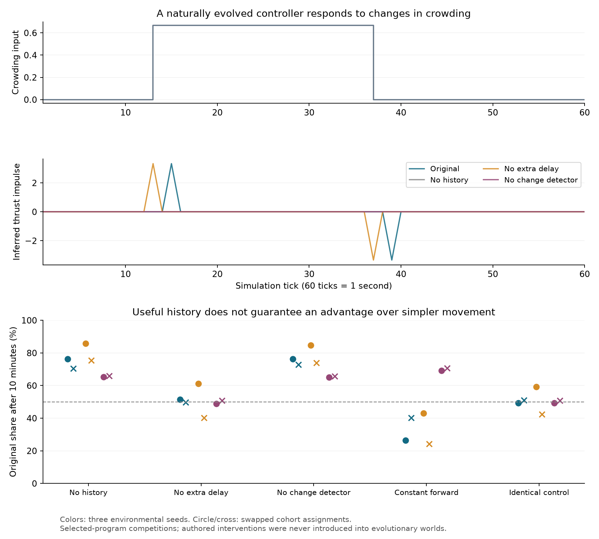

# A naturally evolved response to changing crowding

Program 14515 in temporal world 42 contains the effective movement expression
`(move (lag (delta (crowding))))`. An intervening local binding reads bond count
but is unused by this expression. The program was observed during autonomous
evolution, not designed or seeded as a controller. It is a depth-two archive
descendant of random founder 419. Its observed population was 679, 936, 36 and 16
at 25, 30, 35 and 40 minutes respectively. The original snapshots and census
bytes are retained with hashes in [crowding-source](results/crowding-source/sightings.json).
These counts are sightings, not proof of uninterrupted lineage survival or of
the mutation's selective advantage over its parent.

## What the history actually does

Two passive neighbors create a controlled crowding pulse, remaining outside the
subject's contact-repulsion range. They track its position so movement cannot
alter the cue. Crowding rises at tick 13 and falls at tick 37. With normal costs,
no sunlight, and all three slots occupied, the original program produces a
forward impulse at tick 15 and a backward impulse at tick 39. Both have magnitude
approximately 3.333. Removing only `lag` moves those responses to ticks 13 and 37.
Removing `delta`, or all temporal history, removes both impulses.

The intervention replaces a private history load with the current input, keeping
instruction count, input evaluation and history writes. It can select individual
occurrences, so nested forms need not be removed together. This demonstrates a
causal temporal response. It does not establish an adaptive reason for the delay.



## Does it help establish descendants?

Thirty ten-minute competitions use the observed program, three environmental
seeds and both assignments of the altered cohort. Each starts with 64 unlinked
founders, 32 per cohort, with 24 local and 24 stored energy. Normal clouds, heat,
costs and reproduction apply. There is no immigration, archive sampling or
mutation; capacity is 4,096 in a 2,048-unit world. Actual uploaded altered bytecode
is read back and checked. The two cohorts use the same physics shader.

| Opponent intervention | Original wins by final abundance | Original final share |
| --- | ---: | ---: |
| Remove all history | 6/6 | 65.3–85.8% |
| Remove only extra delay | 3/6 | 40.3–61.2% |
| Remove only change detector | 6/6 | 65.1–84.7% |
| Force movement to constant forward | 2/6 | 24.3–70.8% |
| Identical unmodified program | 3/6 | 42.3–59.3% |

Time-integrated abundance gives the same win counts, except the neutral comparison
is 4/6. The identical-program control exposes founder-assignment and contention
variation, so a single close win is uninformative. The two assignment swaps share
an environmental seed; they are not independent world replicates.

History-driven movement helps against removing movement. The additional delay has
no consistent benefit. Constant forward movement wins in both assignments for
seeds 42 and 97, while the original wins both assignments for seed 321. This is
useful context-dependent memory, not a robust superiority over simple movement.
It also does not demonstrate distributed computation, a complex recurrent
controller, or a general increase in evolutionary complexity. Counting temporal
operators would count a redundant delay as a gain; measuring only the effect of
deleting history would miss the stronger constant-movement control.

## Reproduction and retained evidence

Apply the [temporal-expression patch](experiments/temporal-expressions.patch) in
the documented disposable checkout and copy the current research helpers. Run:

```sh
node research/crowding-pulse-probe.mjs research/results/temporal-crowding-candidate.json /tmp/pulse.json
node research/history-establishment-probe.mjs research/results/temporal-crowding-candidate.json /tmp/history-all.json all
# Repeat treatments lag, delta, forward and intact.
node research/compare-history-establishment.mjs
```

The comparison checks all completed trial counts, source provenance, compiler
interventions, identical founders/settings, shader fingerprints and demographic
accounting against retained [raw reports](results/history-crowding-all.json).
It requires the experimental compiler. The other reports are
[lag](results/history-crowding-lag.json), [delta](results/history-crowding-delta.json),
[forward](results/history-crowding-forward.json),
[neutral](results/history-crowding-intact.json),
[pulse](results/crowding-pulse.json), and
[comparison](results/history-crowding-comparison.json).

The production substrate remains unchanged after mixed results in the completed
temporal-world comparison. Subsequent candidates need the same distinction between a
causal response, a benefit against disabling it, and a benefit against simpler
alternatives in independent environments.
