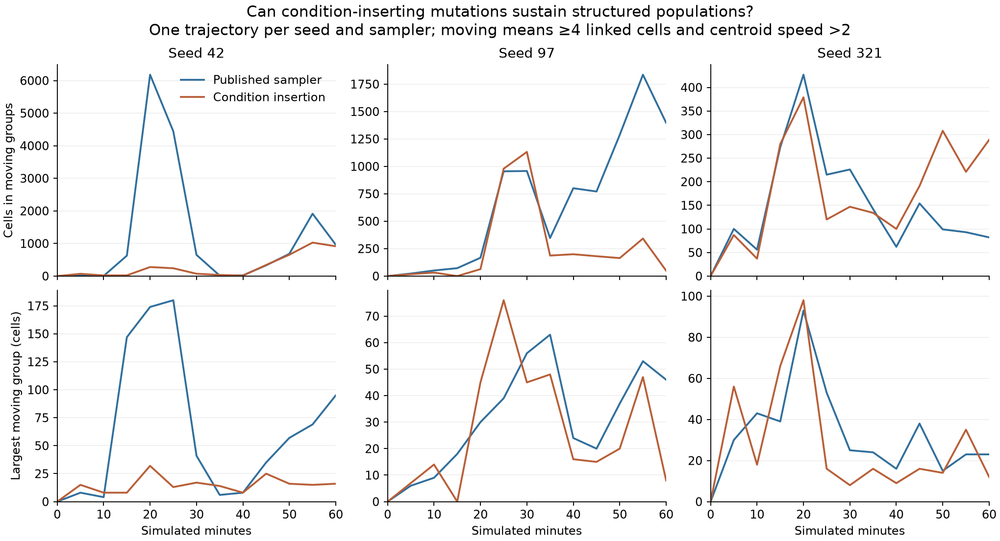

# Conditional insertion did not reliably improve colony structure

The experiment changes half of archive-mutation calls to first try inserting a
random condition around an existing action, preserving that action in one branch.
Founders remain fully random and identical to the published sampler; division
never mutates. The new operator makes regulatory changes easier to reach, but
the measured worlds do not support promoting it to the default.

All six trajectories used the same ecology, 32,768 entity slots, 8,192 random
founders, eight arrivals per simulated second, and no population-floor
replenishment. Each ran for one simulated hour. The control trajectories are the
previously recorded [continuous runs](continuous-evolution.md); these are not
deterministically paired counterfactuals or a large replicated study.

| Seed | Published: living | Insertion: living | Published: cells in moving groups | Insertion: cells in moving groups |
| ---- | ----------------: | ----------------: | --------------------------------: | --------------------------------: |
| 42   |            14,720 |            17,448 |                               961 |                               915 |
| 97   |            11,015 |            24,201 |                             1,397 |                                49 |
| 321  |            32,765 |            32,764 |                                82 |                               289 |



Final counts can depend on the phase of a population boom. The following means
use seven saved observations from minute 30 through 60; they are not exact
continuous time integrals.

| Seed | Published: mean cells in moving groups | Insertion: mean cells in moving groups | Published: mean largest moving group | Insertion: mean largest moving group |
| ---- | -------------------------------------: | -------------------------------------: | -----------------------------------: | -----------------------------------: |
| 42   |                                  653.6 |                                  436.7 |                                 44.4 |                                 15.9 |
| 97   |                                 1056.7 |                                  322.0 |                                 42.7 |                                 28.4 |
| 321  |                                  122.6 |                                  198.6 |                                 23.4 |                                 15.7 |

Two seeds retained fewer cells in moving groups under insertion, and all three
had a smaller mean largest moving group. Seed 321 did retain more cells spread
across smaller moving groups. These mixed results do not justify replacing the
published sampler. Larger population size did not track larger organized bodies.

## More branches are not necessarily more behavior

The insertion sampler increased the number of living cells whose programs
contain conditionals in all three worlds. But common survivors include guards
such as `(kin (none))` and literal `false`, which do not implement a varying
response. The [reachability check](results/tree-guard-reachability.json) found
5,019 exact insertions in 10,000 mutations of the previously observed giving
genome, versus zero in the ordinary operator. This establishes access to a kind
of edit, not adaptive regulation or increased epiplexity.

A moving group here means at least four connected cells with centroid speed
above two world units per second. It does not establish self-propulsion. At
minute 40 of insertion seed 97, the recorded 16-cell group had speed 12.0 while
its genome 14953 contained no `move` action. New research instrumentation records
recent successful thrust separately; historical trials lack those activity
buffers and have not been retroactively relabeled.

## Reproduce and inspect

The [experimental patch and protocol](experiments/README.md#conditional-insertion-separate-continuous-world-experiment)
are separate from the production sampler. Raw variant worlds are in
`runs/continuous-guard-{42,97,321}`. All finished with successful population
ledgers, reciprocal-link checks, genome-reference audits, finite-state checks,
and no reported GPU errors. The variant passed 77 Node tests and 51 GPU lifecycle
checks before running. The subsequent observation tools pass 80 Node tests and
three real GPU activity checks.

```sh
node research/compare-guard-worlds.mjs research/runs research/runs research/results/guard-evolution.json
python3 research/plot-guard-worlds.py research/results/guard-evolution.json research/results/guard-evolution
```

The [machine-readable comparison](results/guard-evolution.json) retains full
sample series, final counts, late-window means, conditional syntax counts, and
the most common conditional genomes for inspection. The original seed 42
control predates progress checkpoints; its finalized run file includes the
final census, leaders, and surviving genomes. This exception is recorded
explicitly by the comparison tool.
