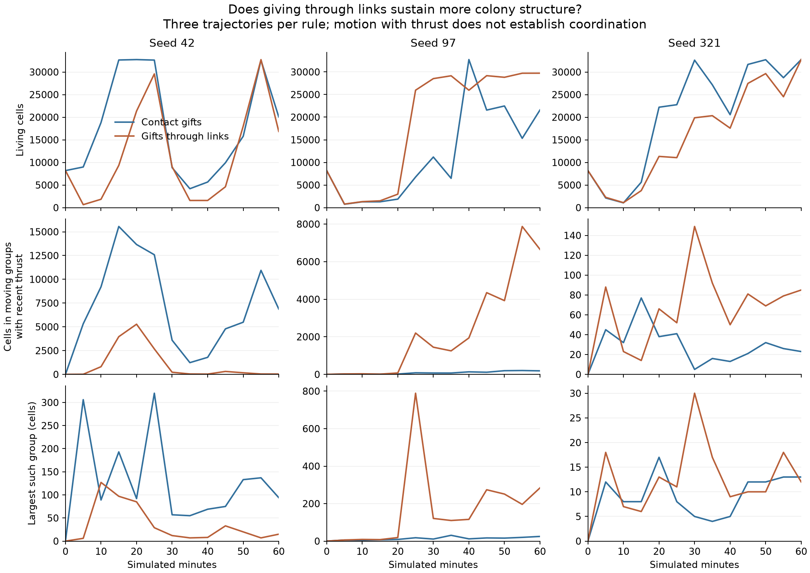
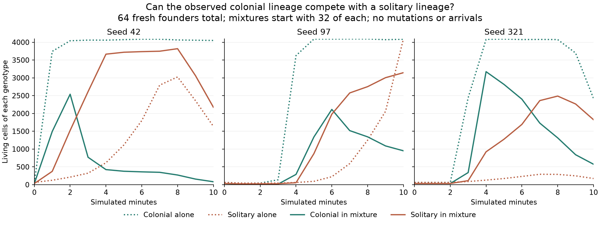

# Linked gifts in continuous evolution

The 0.8.2 link-range correction helped controlled colonies regrow. That is not
sufficient evidence that it sustains more organization in a mixed evolving world.
This follow-up compares three fresh one-hour worlds with reciprocal linked gifts
against three fresh worlds with the previous 18-unit contact-only gift rule.

## Protocol

All worlds use 32,768 entity slots, 8,192 independent random tree founders,
eight new arrivals per simulated second, zero population-floor replenishment,
80% archive mutation, 25% archive crossover and exact-copy division. They use
identical ecological settings and the same current observation code. The contact
control restores only `web/gpu/shader.js` from `d71520e`; the linked condition uses
release `029191b`. No conditional-insertion sampler or multicellular resampling
is enabled. The full configurations and shader fingerprints are saved in each
run, and completion requires population and genome-reference ledgers, reciprocal
links, finite states and no reported GPU errors.

Observations are taken every five simulated minutes. The comparison requires
both a completed checkpoint and final results, equal configurations and samplers,
and fresh thrust measurements in both conditions. Late-window means average the
seven observations from minute 30 through 60; they are not exact time integrals.

A moving body contains at least four linked cells and has centroid speed greater
than two world units per second. A separate measure requires a successful nonzero
thrust event in at least one member during the preceding 60 ticks. Motion with
thrust still does not establish coordinated locomotion, adaptive sensing or
causal dependence on communication. Counts of genomes containing `give` are
reported as syntax only. None of these measurements estimates epiplexity.

One trajectory per seed and condition is a small exploratory comparison. GPU
allocation makes matching seeds nondeterministic; they are not paired physical
counterfactuals. These jobs can share the GPU, so their wall-clock timings are
not performance benchmarks.

```sh
# Run in separate copies with the appropriate shader, for seeds 42, 97 and 321:
node research/gpu-life-run.mjs --substrate=trees --capacity=32768 --initial=8192 --floor=0 --rate=8 --seconds=3600 --sample=300 --seed=42 --out=research/runs/continuous-linked-gifts-42
# Name the old-rule output continuous-contact-gifts-42, and similarly for other seeds.
node research/compare-gift-worlds.mjs /path/to/contact/research/runs /path/to/linked/research/runs research/results/linked-gift-evolution.json
python3 research/plot-gift-worlds.py research/results/linked-gift-evolution.json research/results/linked-gift-evolution
```

## Continuous-world results

All six one-hour worlds completed. Means over snapshots at minutes 30–60:

| Seed | Contact: linked cells | Linked gifts: linked cells | Contact: moving with thrust | Linked gifts: moving with thrust |
| ---: | ---: | ---: | ---: | ---: |
| 42 | 67.8% | 5.2% | 36.1% | 2.1% |
| 97 | 2.8% | 80.6% | 0.8% | 13.5% |
| 321 | 0.7% | 1.1% | 0.1% | 0.4% |

Each entry averages the fraction of the living population at seven observations.
The gift-range correction has a clear controlled regrowth benefit, but these
worlds do not show a consistent increase in persistent colony organization.
Seed 42 favors the old rule; seed 97 favors linked gifts; seed 321 remains mostly
solitary in both. The correction stays because reciprocal springs should support
explicit transfers across their length, not because this small study establishes
higher evolutionary complexity.



## A concrete competing lineage

In the completed linked-gift seed-42 world, the early colonial genotype 8919
was common at minute 20. Its program includes budding, photosynthesis, movement,
eating and giving to the nearest cell. By minute 60 the largest surviving
lineage was genotype 13530, a photosynthesizing, eating, moving splitter. The
world had 16,850 living cells but only 35 cells in moving groups with recent
thrust. Its largest such group contained 15 cells. An earlier large bloom did
not become persistent large-scale colony organization in this trajectory.

The controlled competition assay uses both unedited programs from the same
minute-20 observation. Each starts 64 fresh, unlinked cells at seeded-random
positions, with 24 usable energy and 24 reserves per cell. Pure cultures start
64 of one genotype; mixtures start 32 of each. Each condition uses the same
positions and headings for a given seed. Mixture membership is shuffled. Normal
moving clouds and physics continue for ten simulated minutes, with no arrivals,
archive or mutations. Thus the test separates an ecological competition from
continued changes in the program pool, though it is not a replay of the original
world. Different initial counts per genotype and finite space can affect the
comparison with monocultures.

```sh
node research/colony-competition-probe.mjs research/runs/continuous-linked-gifts-42/observation-1200.json research/results/colony-competition.json
python3 research/plot-colony-competition.py research/results/colony-competition.json research/results/colony-competition
```

The unedited-program competition assay completed all nine trials:

| Seed | Colonial alone | Solitary alone | Colonial in mixture | Solitary in mixture | Mixed cells in moving bodies with recent thrust |
| ---: | ---: | ---: | ---: | ---: | ---: |
| 42 | 4,050 | 1,637 | 82 | 2,175 | 0 |
| 97 | 4,084 | 4,096 | 951 | 3,145 | 664 |
| 321 | 2,423 | 173 | 574 | 1,825 | 302 |



In all three mixtures the colonial genotype initially grew, then declined from
its peak while the solitary genotype became more numerous. The same colonial
program sustained a much larger final population in isolation. In seed 321,
the solitary program also grew far more in mixture than alone. This motivates
a test of selective giving, but does not itself identify energy exploitation:
these recordings do not attribute gifts or scavenged nutrients by genotype.

The next assay uses two explicitly authored controls around the observed gift:
`(give (nearest-cell) (if (alive (nearest-cell)) (bonds) 0))` and the same
expression with `kin` replacing `alive`. Their compiled programs both have 20
instructions and differ in exactly one sensed field. The observed original has
23 instructions, so comparisons against it also change execution timing. `kin`
means exact genome identity, not ancestry. Founders, energy, physiology and
habitat settings match across the alive/kin mixtures. These controls stay in
the research harness; random evolutionary founders are unchanged.

All six guard mixtures completed:

| Seed | Alive guard: colonial / solitary | Kin guard: colonial / solitary | Alive: moving group cells with thrust | Kin: moving group cells with thrust |
| ---: | ---: | ---: | ---: | ---: |
| 42 | 52 / 2,091 | 4,040 / 26 | 0 | 2,019 |
| 97 | 1,301 / 2,794 | 4,055 / 38 | 944 | 1,807 |
| 321 | 949 / 1,724 | 2,717 / 28 | 578 | 788 |

The kin guard raised the colonial fraction to roughly 99% at ten minutes in
all three seeds, compared with 2–36% for the equal-length alive guard. Late-window
means also favor kin: 97–99% colonial versus 5–52%. This supports selective giving
as a useful defense in this particular two-program ecology. It does not prove
that the rule has evolved spontaneously, survives a wider adversarial pool, or
maximizes behavioral epiplexity. Energy traffic by recipient genotype was not
recorded, so the mediated energy mechanism remains to be measured directly.

```sh
node research/colony-competition-probe.mjs research/runs/continuous-linked-gifts-42/observation-1200.json research/results/colony-competition-alive.json 8919 13530 alive mixed
node research/colony-competition-probe.mjs research/runs/continuous-linked-gifts-42/observation-1200.json research/results/colony-competition-kin.json 8919 13530 kin mixed
node research/compare-gift-guards.mjs research/results/colony-competition.json research/results/colony-competition-alive.json research/results/colony-competition-kin.json research/results/colony-gift-guards.json
```

Raw [whole-world comparison](results/linked-gift-evolution.json),
[competition assay](results/colony-competition.json), and
[matched guard comparison](results/colony-gift-guards.json) retain configurations,
source programs and full measurement series. The raw guard runs are
[alive](results/colony-competition-alive.json) and
[kin](results/colony-competition-kin.json). No additional production setting is
changed by this research.
