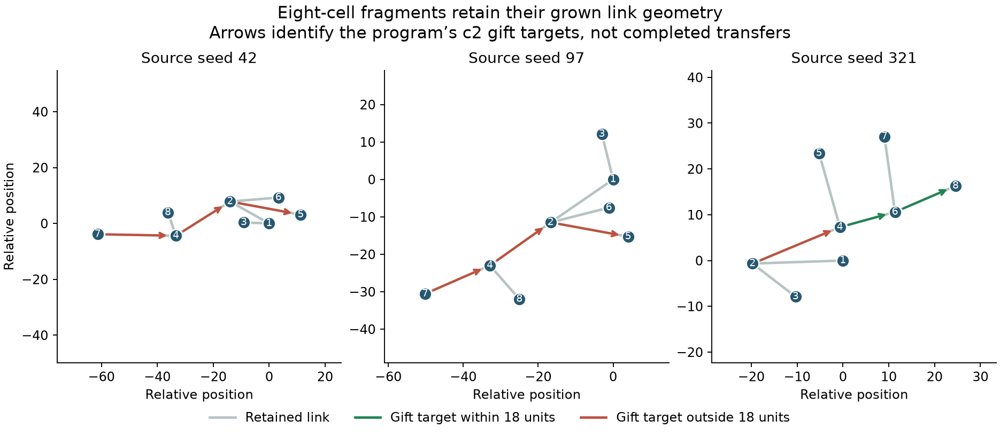

# A single-cell resampling bottleneck

The published archive resamples genomes into fresh individual cells. This
experiment asks whether an existing cooperative genotype can lose its growth
advantage when its initial multicellular context is removed. It uses the
[naturally generated giving genome 15333](continuous-evolution.md), rather than
an authored metabolic program. These are controlled regrowth tests, not proof
of general multicellular fitness or an epiplexity estimate.

## Constructed founder controls

All starts have 96 total usable energy and zero reserves. The single cell gets
96; the four-cell cases get 24 each. A cluster places the cells in the same
positions as a connected star but removes its links. A dispersed control places
leaves 80 units from the center. All cells have fresh physiology and program
state. Comparing connected versus unconnected clusters changes only links and
anchors; comparing one versus four cells additionally changes biomass and
number of metabolic bodies.

Final living counts after 600 simulated seconds:

| Light  | Seed | Single giver | Unconnected cluster | Connected givers | Dispersed givers | Connected, giving disabled |
| ------ | ---: | -----------: | ------------------: | ---------------: | ---------------: | -------------------------: |
| dim    |   42 |            4 |                   4 |               99 |                4 |                          4 |
| dim    |   97 |            4 |                   4 |              165 |                4 |                          4 |
| dim    |  321 |            4 |                   4 |              254 |                4 |                          4 |
| clouds |   42 |           31 |                   3 |              276 |                5 |                          0 |
| clouds |   97 |          806 |                 116 |             4095 |              146 |                         15 |
| clouds |  321 |           31 |                   6 |                8 |               38 |                          5 |

Uniform dim light is 0.6. All single-cell and disconnected dim-light cases
stalled at four cells, while connected givers grew to 99–254. Turning off giving
also made connected groups stall at four. Under moving clouds the connected
start was strongly favored in two seeds; dispersed starts did better in seed 321. Starting in a group is not universally advantageous.

## Fragments with observed geometry

To avoid relying on a constructed star, three fresh cells of the same evolved
genotype were independently regrown for 180 seconds in full sunlight. The largest
connected body in each run supplied an eight-cell breadth-first fragment around
a seeded-random root. This selection was fixed before measuring fragment growth.
The fragments retain exact positional link slots, spring anchors, rest factors,
relative positions and headings. Each cell starts with 12 usable energy, for the
same 96 total. Ages, generations, memory, velocities and program phases reset.
The disconnected control removes only links from precisely the same cells.



| Light  | Source seed | Connected givers: living / births | Disconnected givers: living / births | Connected, giving disabled: living / births |
| ------ | ----------: | --------------------------------: | -----------------------------------: | ------------------------------------------: |
| dim    |          42 |                             8 / 0 |                                8 / 0 |                                       8 / 0 |
| dim    |          97 |                            15 / 7 |                                8 / 0 |                                       8 / 0 |
| dim    |         321 |                         154 / 234 |                                8 / 0 |                                       8 / 0 |
| clouds |          42 |                         203 / 554 |                            108 / 195 |                                      0 / 13 |
| clouds |          97 |                       1200 / 1303 |                            539 / 557 |                                      9 / 10 |
| clouds |         321 |                          51 / 117 |                              13 / 23 |                                       8 / 0 |

Two dim-light fragments reproduced when connected, while all disconnected
fragments and all connected zero-gift controls remained at eight cells. Under
clouds, connected givers produced more births in all three captures. These
results support testing structural resampling alongside single-cell arrivals.
They do not establish that preserving a fragment always helps, nor that this
advantage will persist under mutation or competition in a full evolving world.

The initial gift-target distances also expose a constraint: all three `c2` links
in the stalled seed-42 fragment were outside the 18-unit gift range (25.68,
22.91, and 28.01 units). A spring can remain connected up to 65 units. The geometry
is consistent with gifts being initially unavailable; it is not by itself proof
that range explains the later growth difference. The intervention below tests gifts through a reciprocal link.

## Linked-gift intervention (0.8.2)

The 24 observed-fragment trials were replayed with the exact same captured
geometries and roots, allowing explicit gifts through reciprocal live links up
to the normal 65-unit breaking distance. Direct unlinked giving and attacks
retain their 18-unit range. Costs, energy accounting and programs are unchanged.

Final living counts after 600 seconds:

| Light  | Seed | Connected givers | Disconnected givers | Connected, giving disabled |
| ------ | ---: | ---------------: | ------------------: | -------------------------: |
| dim    |   42 |             4092 |                   8 |                          8 |
| dim    |   97 |             4096 |                   8 |                          8 |
| dim    |  321 |             4096 |                   8 |                          8 |
| clouds |   42 |             3830 |                4067 |                         23 |
| clouds |   97 |             4093 |                4093 |                          9 |
| clouds |  321 |             2888 |                  15 |                          8 |

All three connected dim-light fragments reached or approached the 4096-slot
limit, while their disconnected and zero-gift controls stayed at eight cells.
This supports removing the distance mismatch between spring links and explicit
gifts. Disconnected founders can create new links by budding during regrowth,
so they can also benefit from the new rule later, as in the cloudy trials.
These results are capacity-limited and concern one genotype; they do not measure
open-ended complexity or long-term balance in a mixed evolving world. GPU
allocation is nondeterministic, so even unchanged zero-gift controls can diverge
between runs. The production release adopts the link range change, while
multicellular archive resampling remains a research tool.

## Validation and reproducibility

All 48 constructed-founder, 24 baseline observed-fragment and 24 linked-gift
replay trials completed without
reported GPU errors. They checked population ledgers, genome references, valid
reciprocal links, finite positions/temperature and energy bounds. Recent-thrust
metrics distinguish motion with a recent nonzero thrust event from motion alone;
neither establishes coordinated locomotion.

The extraction helper refuses legacy snapshots lacking positional link slots,
nonreciprocal graphs, missing genotypes, and fragments that wind around the
periodic world and cannot be flattened without changing a retained spring.
Tests verify preserved link-slot holes, wrapped/rotated geometry, source
immutability, energy budgets, explicit rejection, and disconnected controls.

The first two result sets used the 0.8.1 kernel from `d71520e`. To reproduce
that baseline, use these research tools with that version of `web/gpu/shader.js`.
Running the commands on 0.8.2 uses linked gifts instead; the final command
replays the saved baseline captures under the current kernel.

```sh
node research/colony-propagule-probe.mjs research/results/colony-gift-probe.json research/results/replay-propagules.json
node research/colony-fragment-probe.mjs research/results/colony-gift-probe.json research/results/replay-fragments.json
# Reuse the same captures and roots for a changed-physics intervention:
node research/colony-fragment-probe.mjs research/results/colony-gift-probe.json research/results/replay-intervention.json both research/results/colony-fragment-probe.json
```

Raw results are [constructed founders](results/colony-propagule-probe.json) and
[observed fragments](results/colony-fragment-probe.json). They include the full
configurations, kernel fingerprints, fixtures, source captures and histories.
There are three trajectories per condition, selected around one previously
observed genotype. Same-seed GPU allocation can produce different outcomes.
The research tools do not change the default sampler. The linked-gift shader
intervention is included in 0.8.2; other resampling and mutation experiments are
not enabled. [Linked-gift replay results](results/colony-fragment-linked-gifts.json)
include the original captures and new trial kernel fingerprints.
