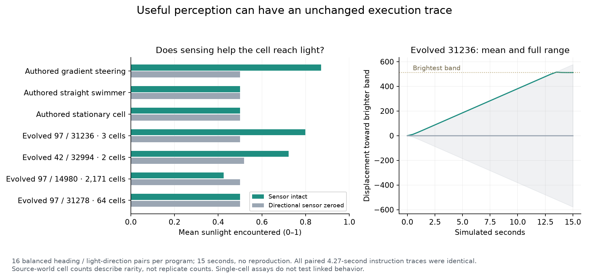

# Perception can be useful without changing the execution path

Two naturally generated programs navigate toward sunlight in controlled replay.
Zeroing the directional sensor removes most of that benefit, while leaving their
program bytes, instruction timing and other sensors unchanged. Nevertheless,
**every paired 256-tick instruction recording is byte-for-byte identical**.
Execution-path gzip cannot distinguish the functioning controller from its
sensor-disabled counterpart in these cases.

This is a concrete calibration failure for path compression and branch variation,
not evidence against measuring execution. The values carried through that
execution matter. A very common program also uses the bearing sensor but moves
away from light on average; sensor syntax and sensor dependence alone are not
usefulness measures.



## Assay and provenance

The four natural programs are unmodified survivors from the completed
[operation-mutation worlds](experiments/point-mutation.md). They were selected
by inspecting sensory/movement expressions, not by a random population sample.
Thus this assay demonstrates existence and failure cases; it cannot estimate the
frequency of adaptive behavior or compare mutation operators fairly. Both
successful examples were rare at the source census: three and two living cells.
Mutation ancestry depths were two and one. A depth-zero bearing-controlled
swimmer had 2,171 living members and performed poorly in this assay.

Each replay has one fresh cell with 70 local energy and 24 stored energy, default
costs, a 2,048-unit periodic world, and a fixed sinusoidal light band ranging from
0.05 to 0.95. Light is sampled on the existing 32-unit grid. The cell starts at
the center slope. Four cardinal band orientations and four initial headings
produce 16 paired conditions per program. These are balanced deterministic
conditions, not 16 independently evolved populations. The light field is written
to both GPU field buffers; cloud evolution is disabled for the assay. Capacity
one prevents reproduction. There are no arrivals or mutations.

The paired intervention replaces only the shader assignment to the relative
sunlight-bearing output with zero. It leaves the gradient-magnitude output,
local-light readings, physics, energy rules and compiled program unchanged.
Turning and moving can consequently consume different energy, which is part of
the behavioral effect. There is no altered CPU budget or shortened replacement
expression. The harness intercepts its own shader creation; production has no
ablation switch. Both actual shader hashes and the nominal engine hash are saved.

Replay lasts 900 ticks (15 simulated seconds). Positions and light are read every
30 ticks, with an additional read at tick 256. Mean encountered light is the
trapezoidal time integral of those samples. Positions are unwrapped to measure
progress along the initial brightward axis. Full instruction paths are captured
for **ticks 1–256 only**; they do not cover the entire 15-second trajectory.
Every program has an additional intact replay at a nontrivial heading, required
to reproduce exactly before attributing a difference to sensing.

The authored positive control is `(seq (photosynthesize) (turn
(sunlight-bearing)) (move 1))`; straight swimming and stationary photosynthesis
are negative controls. These controls exist only in the assay. They were not
inserted into evolving populations.

## Results

| Program | Source living cells | Mean light, intact / zero bearing | Final energy, intact / zero bearing | Instruction ordering savings |
| --- | ---: | ---: | ---: | ---: |
| Authored gradient steering | — | 0.871 / 0.500 | 60.74 / 46.36 | 94.2% |
| Authored straight swimmer | — | 0.500 / 0.500 | 46.36 / 46.36 | 92.6% |
| Authored stationary cell | — | 0.500 / 0.500 | 48.84 / 48.84 | 86.8% |
| Seed 97, genotype 31236 | 3 | **0.799 / 0.500** | **61.30 / 47.60** | 93.6% |
| Seed 42, genotype 32994 | 2 | **0.723 / 0.518** | **42.66 / 38.10** | 94.2% |
| Seed 97, genotype 14980 | 2,171 | 0.425 / 0.500 | 44.48 / 48.84 | 92.3% |
| Seed 97, genotype 31278 | 64 | 0.500 / 0.500 | 48.83 / 48.84 | 93.9% |

All cells survived the assay. All 112 paired instruction recordings were
identical, so their compressed sizes were identical as well. There are no varying
conditional branches for genotype 31236 or the authored steering control.
Genotype 32994 has one varying branch; its persistent-state initialization is an
additional reason not to attribute branch variation directly to perception.

Genotype 31236 executes:

```lisp
(seq
  (do (photosynthesize) (link (none)))
  (split)
  (photosynthesize)
  (turn (sunlight-bearing))
  (move (storage)))
```

Its stored energy supplies the magnitude of thrust, which saturates at one in
this fresh-state assay. It reaches the brightest band, roughly 512 units from
the starting point, across all 16 conditions. Its average final local energy is
28.8% higher with the sensor intact. This is a simple useful reflex, not evidence
of memory-based planning or distributed computation.

The common genotype 14980 uses `(move (sunlight-bearing))` without steering.
Signed bearing becomes saturated forward/backward thrust. Its sensor-dependent
motion reduces light exposure in these balanced conditions. The distinct
31278 uses `(move (linked_storage))`; without linked neighbors that value is
zero. Its null result here cannot establish that it is useless in a colony.

## Consequences for the measurement loop

Keep path gzip as a transparent diagnostic, with shuffled controls and exported
raw records. Do not optimize it as though more compression meant more adaptive
complexity. Likewise, ancestry depth, tree depth, visited instructions and sensor
syntax are descriptors, not interchangeable measures of useful computation.

Use a collection of **causal, task-specific checks** to calibrate candidate
measures: useful orientation toward resources, stored-energy foraging,
communication-dependent group motion, and memory-dependent responses to changing
environments. A positive check should survive rotations and changed conditions,
and lose its benefit under a matched intervention. Path recordings should be
extended with quantized sensor, state and action values if they are to observe
continuous controllers like these. Value compression will still require negative
controls for noise, oscillators and unused calculations.

This first assay is deliberately narrow. It has static bands, fresh reserves,
no reproduction and no interaction. It does not show selection for the reflex,
robustness to moving clouds, competitive advantage in the original world, or
superiority of the experimental mutation operator. Tuning ecology to this one
light task could simply select a short gradient-following reflex. That would be
another failure if labeled general complexity.

## Reproduction and retained evidence

The probe ran against release `54031ce` (0.8.4), Node 24.4.1, Dawn WebGPU 0.6.0,
and Metal on the development Mac. All seven intact repeats matched, both negative
controls were unaffected, the positive control improved, and no uncaptured GPU
errors occurred. A separate check recomputes source provenance, actual shader
hashes, all 224 gzip measurements, structural summaries, trace equality and light
integrals from the saved records.

```sh
node research/sensory-motion-probe.mjs research/results/sensory-candidates.json /tmp/sensory-motion.json full
node research/check-sensory-record.mjs
python research/plot-sensory-motion.py research/results/sensory-motion.json /tmp/sensory-motion.png
```

- [Candidate trees and source hashes](results/sensory-candidates.json)
- [Paired trajectories and measurements](results/sensory-motion.json)
- [Full record including raw execution paths](results/sensory-motion.json.gz)
- [Source-world compressed records and uncompressed SHA-256 manifest](results/point-worlds/manifest.json)

The record checker intentionally verifies the current shader against the saved
hash. Replay/check against the recorded release if production physics changes.

## Follow-up: the ecological ranking reverses

The [descendant-establishment assays](sensory-establishment.md) show why this
short task cannot become the evolutionary objective. The strongest light-seeker
loses under normal heat, then wins when thermal damage is disabled. A common
program that loses light exposure here establishes well in the full ecology,
including five of six comparisons against constant forward thrust. The paired
trace result remains valid, but the functional interpretation must include the
actual ecological trade-offs and reproduction.
