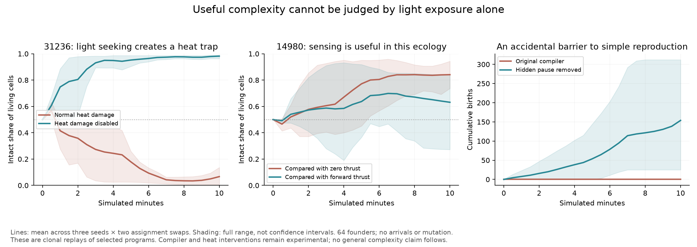

# Rechecking the light-navigation proxy through reproduction

The [short sensory assay](sensory-complexity.md) correctly identified light
steering, but its ranking does not predict clonal establishment in the normal
ecology. The strongest light-seeker loses to its bearing-disabled counterpart.
Disabling heat damage reverses that result. Conversely, the common program that
lost light exposure in the short assay establishes well under normal clouds.



## Controlled comparisons

Each world starts with 64 unlinked cells at seeded random positions and headings,
24 local energy and 24 reserves. Two slots hold identical compiled genomes, with
32 founders assigned to each. One slot's relative sunlight-bearing output is
replaced by zero in the assay shader. The intervention preserves instruction
count, timing, gradient magnitude and other sensors. Both choices of altered
slot are tested for seeds 42, 97 and 321, using the same positions and assignments.

Default sunlight, moving clouds, temperature, energy, physics and reproduction
run for 600 seconds in a 2,048-unit world with 4,096 slots. There is no immigration,
archive or mutation. This is an ecological replay of selected natural programs,
not a fresh evolutionary run. Atomic contention can affect divergent descendants;
swapping roles is a bias check, not a promise of exact GPU counterfactual replay.

Censuses every 30 seconds retain each genotype's abundance, births, deaths, mean
energy, reserves, sunlight, temperature, speed and generation. Final abundance
and integrated cell-seconds are separate outcomes. All population and birth
accounting is checked. The saved comparison verifies configuration, actual
intervention shader hashes and compiled program text.

## Where the short proxy fails

| Program / intervention | Intact wins by final abundance | Intact wins by integrated abundance | Final intact share |
| --- | ---: | ---: | ---: |
| Light-seeker 31236 / zero bearing | 0 of 6 | 0 of 6 | 0.4–13.6% |
| Light-seeker 31236 / zero bearing, heat damage disabled | 6 of 6 | 6 of 6 | 96.3–99.1% |
| Rare 32994 / zero bearing | 6 of 6 | 3 of 6 | 60–100% |
| Common 14980 / zero bearing | 6 of 6 | 6 of 6 | 73.6–94.3% |
| Common 14980 / constant forward thrust | 5 of 6 | 5 of 6 | 27.2–84.0% |

For 31236, the seed-97 intact groups finish with only seven or eight cells, around
33.2 degrees, while the zero-bearing groups have 1,227 or 1,859 cells at roughly
26–27 degrees. Removing **only thermal damage for both competitors** reverses
the outcome in all six comparisons. This supports a causal role for heat in the
failure, without isolating every contribution from crowding, movement or changing
clouds. Heat remains enabled in production; making a simple light-seeker dominate
is not by itself a reason to remove this ecological pressure.

Storage is also diluted by division. The successful heat-disabled descendants
have less than one reserve unit on average, so their `(move (storage))` command
weakens. Its short assay began with fresh reserves and missed that change in
behavior over generations.

The high final share for 32994 is another trap: only three to six intact cells
remain, most original founders, and there are zero to two intact births in a
trial. A near-empty world with a few survivors must not score as a complex,
self-maintaining lineage merely because its competitor disappeared.

The common 14980 uses `(move (sunlight-bearing))`, with no turn instruction. The
zero-bearing intervention stops its commanded movement, so this comparison
alone cannot attribute the benefit to directional information. A second
intervention returns 180 degrees, producing saturated positive thrust with the
same VM timing. The natural program wins five of six such trials, but loses one
seed-97 assignment. This is evidence that its conditional forward/backward
response can be useful in this ecology; it does not establish optimality or
rule out a suitably tuned open-loop speed/reversal controller. It also does not
show that it is a light-seeker. The short assay showed the opposite.

The authored straight-swimming/dividing control has no directional sensor.
Under the original compiler all six trials end in extinction with zero births;
before extinction, swapping the intervention labels reproduces its recorded
per-slot trajectories exactly. It is a useful check against unintended shader
changes, but not a reproductive neutral-drift calibration.

## An unintended cadence barrier, and an isolated experiment

That last failure exposed a compiler/ecology interaction. The compiler inserts
`wait 0` at the end of every tree, while a division request independently yields
the current tick. A short photosynthesize-and-divide loop therefore takes two
ticks and photosynthesizes on only one. Even at maximum light, its average input
is at most two energy per second. With upkeep 0.5 and local-energy decay 0.05,
its approximate energy equilibrium is below 30, before CPU/action costs. Division
requires 36 energy. The program cannot reach it from the default founder energy
of 24 through photosynthesis alone. Repeating photosynthesis on both sides of
the division changes that opportunity substantially.

The [compiler-cadence experiment](experiments/implicit-wait.md) removes only the
implicit end-of-tree wait, leaving explicit waits and the VM budget. In a
full-light one-cell replay with normal costs, the unchanged minimal program goes
from zero births to nine over 60 seconds. The two compilers generate exactly the
same 1,000 sampled founder trees under a controlled equivalent size boundary.

This changes action frequency, so it is not a free improvement for established
controllers. Replaying the same four programs yields mixed sensory-ablation
outcomes; the previously nearly sterile straight-swimming control can reproduce,
while some old controllers move more aggressively and establish less well.
Matched random-founder evolutionary worlds are now testing the changed opportunity
structure. The compiler change remains experimental.

## What to measure next

A useful evaluation should retain at least four separate checks:

1. The behavior actually depends on sensory/state information, rather than just
   requiring nonzero actuation.
2. That dependence helps maintain descendants under the full ecology, across
   several conditions and counterfactual controls.
3. The mechanism requires more than a short reflex, unused code or repeated
   operations. Record values and actual data flow to investigate this.
4. Tuning improves those distinctions without merely exploiting a task score,
   winning a nearly empty world or disabling the pressure that made regulation
   necessary.

These results have not established a universal complexity scalar, distributed
computation or a transition to complex multicellular organization. They do change
the next experiment: evaluate controller values and full ecological consequences,
while removing or accounting for accidental compiler timing advantages.

## Retained evidence

All assays used Node 24.4.1, Dawn WebGPU 0.6.0 and Metal. Sixty completed clonal
trials are retained: 24 baseline, six heat controls, six constant-forward controls,
and 24 compiler-cadence replays. The compiler variant passed 97 Node tests and
53 GPU lifecycle checks; three memory tests that require once-per-tick updates
use explicit waits, and a new check verifies budget-limited repeated evaluation.

```sh
node research/sensory-establishment-probe.mjs research/results/sensory-candidates.json /tmp/establishment.json full zero control-straight-division,31236,32994,14980
node research/sensory-establishment-probe.mjs research/results/sensory-candidates.json /tmp/heat.json full no-heat-damage 31236
node research/sensory-establishment-probe.mjs research/results/sensory-candidates.json /tmp/forward.json full forward 14980
node research/compare-sensory-establishment.mjs
```

The comparison expects the recorded baseline compiler and verifies the variant's
source by removing exactly the recorded final wait. See the experiment protocol
for replaying the variant.

[Baseline trials](results/sensory-establishment.json),
[heat intervention](results/sensory-establishment-no-heat-damage.json),
[constant-forward intervention](results/sensory-establishment-forward.json),
[cadence trials](results/sensory-establishment-no-implicit-wait.json),
[validated comparison](results/sensory-establishment-comparison.json).
